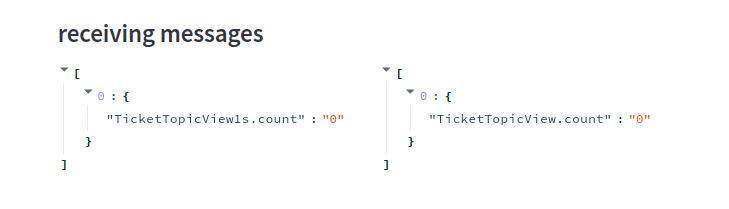

# Connecting Cube Js to Streamlit via websocket

1. Make sure you enable websocket feature in cube js ```CUBEJS_WEB_SOCKETS=true``` in ```docker-compose.yml```
2. Open your Cube js playground, then you need to setup your JWT token
    -   for dev 
    -   for prod 
    -   create JWT 
3.  Edit ```main.py``` Assign your cube-js API URL in WS_CONN variable ```WS_CONN = f"ws://localhost:4000/cubejs-api/v1"```
4. Send your JWT token as websocket message ```
authorization = {
    "authorization": "PUT HERE",
}```
5. To query your data, put your query like example ```json
{
    "messageId": 1,
    "method": "subscribe",
    "params": {
        "query": {
            "measures": ["TicketTopicView.count"],
            "timeDimensions": []
        },
        "queryType": "multi"
    }
}
```
6.  You can send multiple query by set different ```messageId``` value
7. ```streamlit run main.py```
